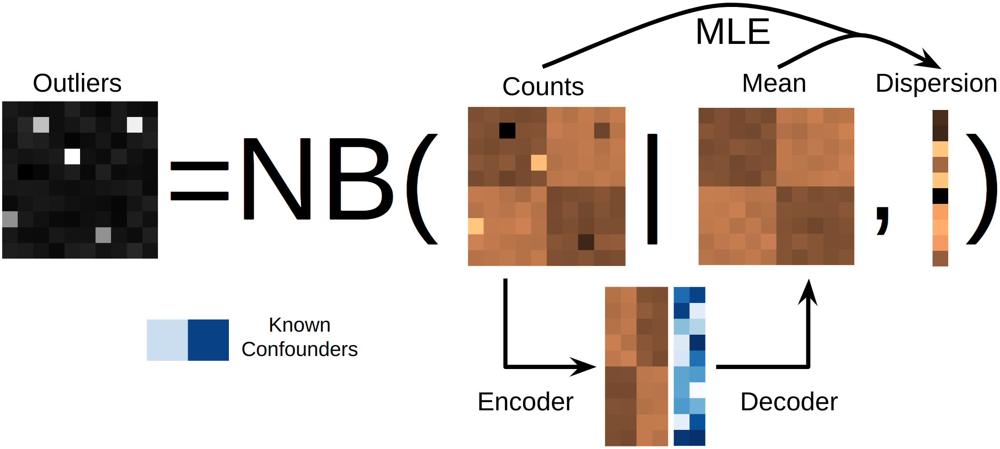

# EpiOut

[](https://pypi.python.org/pypi/epiout)
[](https://github.com/uci-cbcl/EpiOut/actions)
[](https://codecov.io/gh/uci-cbcl/EpiOut/)
[](https://epiout.readthedocs.io/en/latest/?badge=latest)




## Install

Install `epiout` and its companion packages with:
```bash
pip install epiout
```

`hic-straw` is optional dependency to annotate chromatin interactions with `EpiAnnot`:
```
conda install -c bioconda hic-straw
```
or 
```
conda install -c conda-forge curl
pip install hic-straw
```

and another optional dependency is `onnxruntime` to predict aberrant gene expression from aberrant chromatin accessibility:
``` 
pip install onnxruntime
```

## Usage

Counting chromatin accessibility from ATAC-seq data with `EpiCount`:
```bash
epicount --bed {bed} --alignments {alignments.tsv} --output_prefix {output_prefix} --cores {threads}
```

where `bed` is a bed file of genomic regions to count accessibility, `alignments.tsv` is a tab-delimited file of ATAC-seq alignments, `output_prefix` is the prefix of output files, and `threads` is the number of threads to use. See `epicount --help` for more details.

`alignments.tsv` lists bam files of ATAC-seq alignments, one file per line, with the following columns:
```
path/a.bam
path/b.bam
path/c.bam
```
File names are used as sample names in the output files. Alternatively, you can use a tab-delimited file with the following columns to specify sample names:
```
path/a.bam	sample_a
path/b.bam	sample_b
path/c.bam	sample_c
```

`EpiCount` will generate three files: `prefix.counts.parquet`, `prefix.raw_counts.parquet`, `prefix.bed`. The parquet files containing the count matrix. The `raw_counts` file is not filtered for replication and `counts` file is filtered. `bed` file containing replicated the genomic regions across samples. The parquet file can be loaded with `pandas` and looking like:

```python 
df = pd.read_parquet('output_prefix.parquet')
df
```


### EpiOut

To call outliers with EpiOut, run:

```bash
epiout --count_table {prefix.counts.parquet} --output_prefix {output_prefix} --cores {threads}
```

where `count_table` is the output of `EpiCount`, `output_prefix` is the prefix of output files, and `threads` is the number of threads to use. See `epiout --help` for more details. You can pass ordinary csv file of count matrix to `--count_table` argument where rows are genomic regions and columns are samples. 

Output of `EpiOut` is `prefix.h5ad` file and `prefix.results.csv`. h5ad file contains statistics about outliers
```python
from epiout import EpiOutResult

result = EpiOutResult.load('result.h5ad')

# outliers as dataframe
result.outlier

# log adjusted p-values as dataframe
result.log_padj

# results as dataframe alternatively read results.csv file
df_results = result.results()

# Visualize outliers or accessibile regions
result.qq_plot('chr1:100-200')
result.plot_counts('chr1:100-200')
result.plot_volcona('chr1:100-200')
```
See the documentation of `EpiOutResult` for more details.

EpiOut performs hyperparameter optimization to tune optimal bottleneck size of autoencoder. To specifiy the bottleneck size, use `--bottleneck_size` arguments.


## EpiAnnot

```bash
epiannot_create --tissue {tissue or cell line name} --output_prefix {output_prefix}
```

where `tissue` is the name of tissue or cell line avaliable on ENCODE to fetch, `output_prefix` is the prefix of output files where `config.yaml` will be created and contains metadata and related files will be downloaded. See `epiannot_create --help` for more details:

Also you can check avaliable `tissues` or `cell lines`:

```bash
epiannot_list
```

To annotate accesible regions and chromatin interactions with `EpiAnnot`, run:

```bash
epiannot --bed {bed} --gtf {gtf} --counts {prefix.h5ad} --chrom_sizes {chrom_sizes} --output_prefix {output_prefix}
```

where `bed` is a bed file of genomic regions to annotate, `gtf` is a gtf file of gene annotations, `counts` is the output of `EpiOut` in h5ad file format or `counts` obtained with EpiCount, `chrom_sizes` is a file of chromosome sizes can be generated with pyfaidx from fasta file, and `output_prefix` is the prefix of output files. See `epiannot --help` for more details.

Output contains `prefix.annotation.csv` annotation of genomic regions based on histone marks provided in the config file, `prefix.gtf.csv` annotation on regions based on the proximity to genes, `prefix.interaction.csv` annotation of chromatin interactions between regions and `prefix.genes.csv` indicating that poteintial effected by the aberrant chromatin accessibility.

You can create annotation with your custom config file:

`config.yaml`
```yaml
H3K27ac:
- ENCFF817IVB.bed.gz
- ENCFF916FML.bed.gz

H3K4me1:
- ENCFF456GWH.bed.gz

H3K4me3:
- ENCFF867WVM.bed.gz

your_custom_mark:
- a.bed

hic:
- ENCFF311CLH.hic
- ENCFF787ZVA.hic
```

They keys in the config file are the names of histone marks and the values are the list of bed files of histone marks. The config file can also contain a list of hic files to annotate chromatin interactions. Hic data is optional. The config file can be created with `epiannot_create` command or you can use your config file. To call promoter, active and poised enhancers please make sure that you name your histone marks as `H3K4me3`, `H3K27ac`, and `H3K4me1` respectively. An other histone mark or bed files can be used annotate regions. Output `prefix.annotation.csv` will have a column for each key in the config file and will incidate if accesible region overlaps with the annotation source.